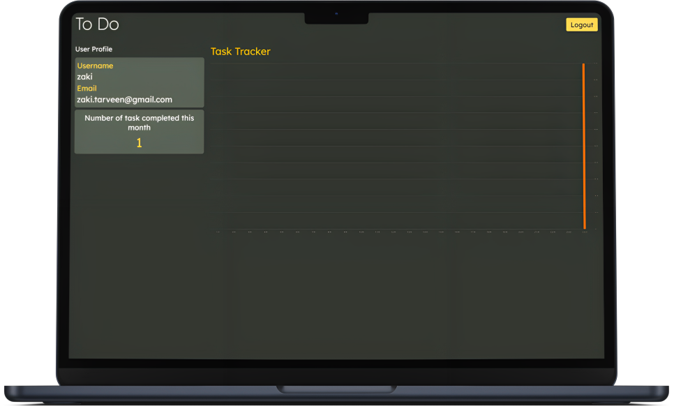

## Floran To Do Website

## Introduction

Floran Todo is a personal task manager designed to assist you in organizing your daily tasks effectively while providing valuable analytics on your completed tasks each day.

<b>Features</b>
<ul>
<li>Basic Todo Feature</li>
<li>Monthly analytic</li>
<li>Easy UI</li>
</ul>

## Output

<b>Mainpage</b>
<br>

<br>
<b>Profile page</b>
<br>


## Requirement
Node.JS

## Usuage

Clone Repository
```bash
    git clone https://github.com/bhagwanZaki/floran-todo-next.git
```
Install all the packages

```bash
  npm i
```

Run the script

```bash
  npm run dev
```

Now you goto localhost:3000 to see the website

```bash
    http://127.0.0.1:3000/
```
